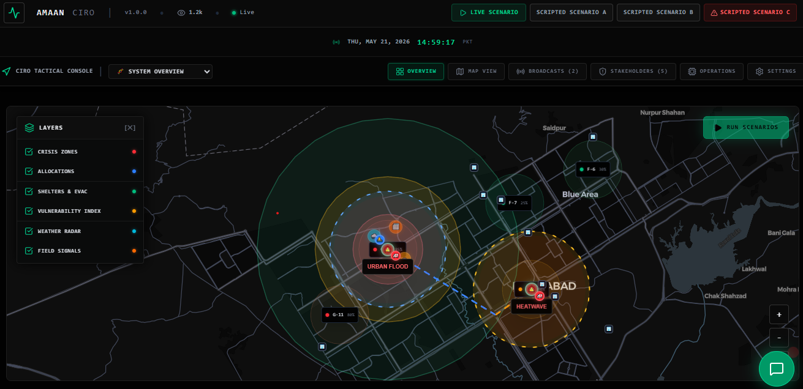
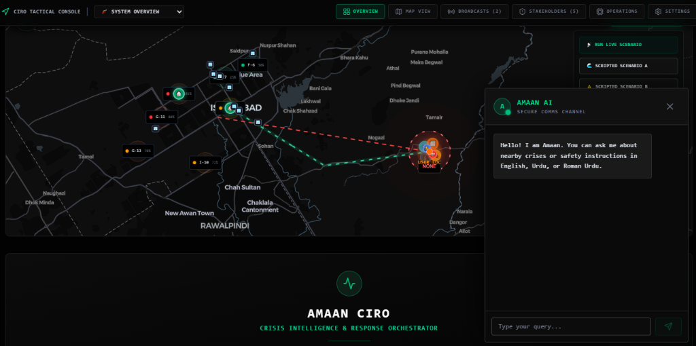
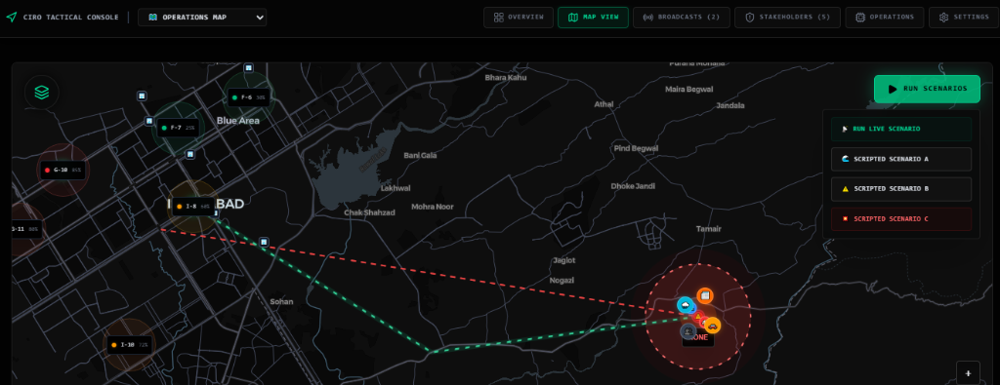
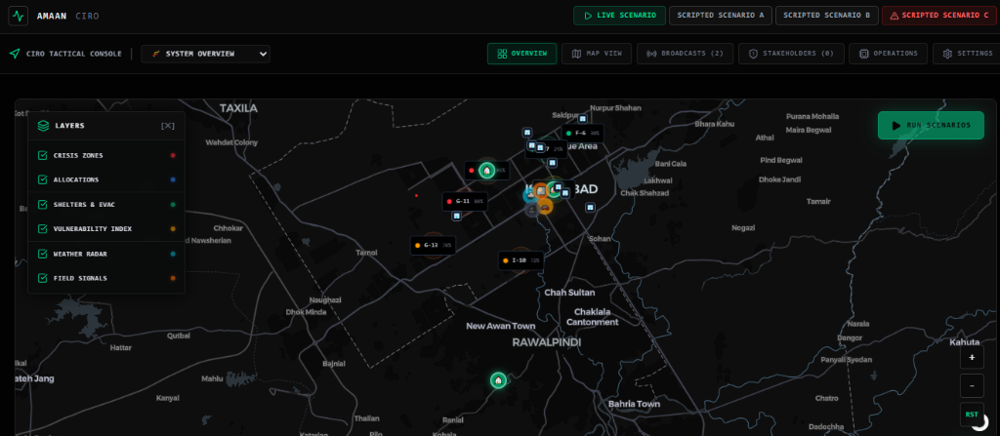
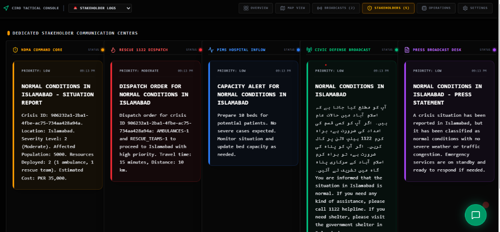

# Amaan CIRO

Real-time Multi-agent Crisis Intelligence & Response Orchestrator (CIRO) for urban crisis detection, resource allocation, and coordinated emergency response for Islamabad city. 

[](https://amaan-ciro-web.vercel.app)
[](https://amaan-ciro-485623882730.asia-south1.run.app/docs)
[](#compiling-the-android-apk)



---

## What This Is In Agentic  Workflow

Amaan CIRO is an agentic AI system that ingests real-time signals from weather APIs, traffic feeds, news sources, and citizen field reports — then autonomously classifies crises, predicts severity, allocates constrained emergency resources, simulates response outcomes, and broadcasts bilingual stakeholder alerts. Every decision is traceable through structured JSON reasoning logs.

The system handles simultaneous multi-crisis coordination (e.g., flooding and heatwave at the same time), detects and resolves contradictory signals, recovers from false alarms, and degrades gracefully when APIs fail.

**Live deployments:**

| Platform | URL |
|----------|-----|
| Web Command Dashboard | [amaan-ciro-web.vercel.app](https://amaan-ciro-web.vercel.app) |
| Backend API & Swagger | [amaan-ciro-...run.app/docs](https://amaan-ciro-485623882730.asia-south1.run.app/docs) |
| Android APK | `src/mobile/android/app/build/outputs/apk/debug/app-debug.apk` (4.7 MB) |

---

## Problem

Pakistan loses billions of rupees and hundreds of lives annually to reactive, fragmented emergency management. The 2022 Karachi floods killed 36 people and caused PKR 14 billion in damage — not because the crisis was unforeseeable, but because emergency services received information from multiple disconnected channels with no unified intelligence to determine which signals to trust, where to send resources first, or how to split limited assets across competing emergencies.

Amaan doesn't predict disasters. It makes every response decision in seconds, with full transparency on why each decision was made.

---

## Architecture

```
Amaan-CIRO/
├── src/
│   ├── backend/        # FastAPI + LangGraph agent engine (Python)
│   │   ├── agents/     # 8 independent AI agent classes
│   │   ├── graph/      # LangGraph StateGraph orchestration
│   │   ├── models/     # Pydantic schemas for all I/O
│   │   └── main.py     # API routes, demo scenarios, orchestrator
│   ├── frontend/       # Vite React SPA (TypeScript + Tailwind)
│   │   └── src/
│   │       ├── components/  # Map, panels, chat, stakeholder UI
│   │       └── store/       # Zustand state management
│   └── mobile/         # Ionic Capacitor → Android APK wrapper
│       └── android/    # Native Android project (Gradle)
├── data/               # Static datasets (vulnerability, inventory, scenarios)
└── docs/               # Screenshots and documentation
```

### System Design

```
                          ┌─────────────────────────────┐
                          │     React SPA (Vite)        │
                          │  MapLibre WebGL + Zustand   │
                          └──────────┬──────────────────┘
                                     │ HTTP/REST
                                     ▼
                          ┌─────────────────────────────┐
                          │   FastAPI on Cloud Run      │
                          │   LangGraph StateGraph      │
                          └──────────┬──────────────────┘
                                     │
              ┌──────────┬──────────┬┴─────────┬───────────┐
              ▼          ▼          ▼          ▼           ▼
         Open-Meteo  Google Maps  GDELT    Citizen     Gemini /
         (Weather)   (Traffic)   (News)   Reports    Groq LLMs
```

The backend runs 8 specialized agents in a **stateful, cyclic LangGraph topology** — not a linear pipeline. If the classification agent produces low confidence or detects contradictions, the graph loops back through a verification-reflection cycle (up to 2 iterations) before proceeding to resource allocation.

---

## The 8 Agents

Every agent is an independent Python class inheriting from `BaseAgent`. Each accepts typed Pydantic input, returns typed Pydantic output, and logs structured reasoning traces to Firestore. No agent has external runtime dependencies beyond the Gemini/Groq LLM endpoints.

| # | Agent | Responsibility | Key Output |
|---|-------|---------------|------------|
| 1 | **SignalIngestionAgent** | Polls Open-Meteo, Google Traffic, GDELT, citizen reports. Scores credibility (0.0–1.0). Flags signals older than 2 hours as stale with a 0.30 credibility penalty. | `List[RawSignal]` with credibility scores |
| 2 | **CrisisClassificationAgent** | Classifies crisis type (`urban_flood`, `heatwave`, `accident`, `power_outage`, `infrastructure`, `compound`) with confidence score. Detects contradicting signals. Uses Gemini with rule-based fallback. | `CrisisObject` with confidence + contradiction data |
| 3 | **SeverityPredictionAgent** | Quantifies severity (Level 1–5), affected population, geographic spread, estimated duration, and cascading risks using NDMA sector vulnerability data. | `SeverityPrediction` with population/duration estimates |
| 4 | **ResourceAllocationAgent** | Optimizes dispatch of ambulances, rescue boats, rescue teams, police units, medical outreach, water tankers, and generators across simultaneous crises. Applies a **15% fairness bonus** for low-income sectors to prevent deprioritization. | `AllocationPlan` with per-crisis justifications |
| 5 | **SimulationAgent** | Models before/after impact states. Compares Amaan's response against NDMA's historical manual baseline (response time: 23 min → 8 min average). | `SimulationResult` with metrics |
| 6 | **StakeholderCommsAgent** | Generates bilingual (English + Urdu) messages for 5 audiences: NDMA Command, Rescue 1122, Hospitals (PIMS), Public Citizens, and Media. | 5 stakeholder message objects |
| 7 | **VerificationAgent** | Monitors for contradictions, false alarms, and retractions. Can retract a crisis and broadcast correction messages. Triggers reflection loop with ClassificationAgent. | Verdict: `confirmed`, `needs_review`, or `retracted` |
| 8 | **ChatAgent** | Multilingual citizen Q&A (English, Urdu script, Roman Urdu). Answers questions about nearby dangers, shelters, and safety actions using live crisis context. Also answers system architecture questions. | Chat response with safety actions |

### Agent Pipeline Flow

```
           START
             │
             ▼
   [Signal Ingestion] ──── (No signals?) ──→ END (Monitoring)
             │
             ▼
   [Crisis Classification] ◄───────────────────┐
             │                                   │ Reflection Loop
             ▼                                   │ (Max 2 cycles)
   (Confidence ≥ 0.50?)                         │
      │              │                           │
     Yes            No / Contradiction           │
      │              │                           │
      ▼              ▼                           │
   [Severity]   [Verification] ─────────────────┘
      │              │
      │         Retracted? ──→ END (Send retractions)
      │              │
      ▼         Confirmed ──→ [Severity]
   [Resource Allocation]
      │
      ▼
   [Simulation]
      │
      ▼
   [Stakeholder Comms]
      │
      ▼
     END

   [Chat Agent] ← runs independently, not part of this pipeline
```

---

## Data Sources & APIs

### Real-time APIs (Live in production)

| Source | API | Data Provided | Auth |
|--------|-----|---------------|------|
| **Open-Meteo** | `api.open-meteo.com/v1/forecast` | Hourly rainfall (mm), temperature, wind speed | None (free, 10K calls/day) |
| **GDELT Project** | `api.gdeltproject.org/api/v2/doc/doc` | Real-time crisis news, social signals, tone analysis | None (free, unlimited) |
| **Google Maps Platform** | Distance Matrix, Directions | Traffic congestion, travel times for resource dispatch | API key (GCP credits) |
| **Gemini 2.0 Flash** | `google-generativeai` SDK | Crisis classification, severity reasoning, chat responses | API key |
| **Groq** | `groq` SDK | LLM inference fallback for stakeholder comms | API key |

### Static Datasets (Pre-loaded, no API call)

| File | Purpose |
|------|---------|
| `data/ict_vulnerability.json` | NDMA sector vulnerability scores for 7 Islamabad sectors (G-10, G-11, G-13, I-8, I-10, F-6, F-7). Includes flood vulnerability, drainage capacity, population density, low-income flags, and historical flood event counts. |
| `data/resource_inventory.json` | Emergency fleet inventory: 12 ambulances, 6 rescue boats, 8 rescue teams, 10 police traffic units, 4 medical outreach teams, 5 water tankers, 8 generators, 3 emergency shelters with GPS coordinates. |
| `data/demo_scenarios.json` | Pre-scripted signal sets for reliable demo execution. Used as fallback when live APIs are rate-limited or unavailable. |
| `data/baseline_metrics.json` | NDMA historical response benchmarks for before/after simulation comparisons. |
| `data/karachi_vulnerability_map.json` | GeoJSON vulnerability data for Karachi districts (secondary coverage). |

### Mock vs. Real — Transparency

The system is designed with a 3-tier data strategy:
1. **Live APIs** — Open-Meteo weather, GDELT news signals (called on every pipeline run)
2. **Firestore cache** — Recent pipeline results cached for fast retrieval
3. **Static fallback** — `data/demo_scenarios.json` loaded automatically if all live APIs fail

When running in `DEMO_MODE=True`, the system uses pre-scripted signals to guarantee deterministic scenario execution. The `fallback_used` boolean in every agent trace explicitly marks whether real or mock data was used.

---

## Dashboard & Map Interface

The frontend is a high-performance single-page application designed for Emergency Operations Center operators.



### Map Engine (MapLibre GL WebGL)

The interactive map renders 7 toggleable data layers on a GPU-accelerated WebGL canvas:

| Layer | Visual | Description |
|-------|--------|-------------|
| Crisis Zones | Pulsing red/blue circles | Active crisis epicenters with animated ⚠️ markers. Blue = flood, amber = heatwave. |
| Weather Radar | Concentric color bands | Simulated Doppler precipitation — red (heavy), amber (moderate), green (light). |
| Resources | Dashed dispatch lines | Fleet station bases (🏢) with dispatch route lines to crisis targets. |
| Shelters | Green markers with capacity bars | 3 emergency shelters with real-time occupancy tracking. |
| Vulnerability | Color-coded sector badges | NDMA risk scores per sector. Click for drainage, density, and historical data. |
| Field Signals | Pulsing source icons | Live signal sources — 🌧️ weather, 🚗 traffic, 📰 news, 👥 citizen reports. |
| Evacuation Routes | Green dashed lines | Computed safe passage from crisis zone to nearest shelter. |

<table>
  <tr>
    <td width="50%" align="center">
      <b>Map View with Active Crisis Zones</b><br/>
      
    </td>
    <td width="50%" align="center">
      <b>Interactive Layer Controls</b><br/>
      
    </td>
  </tr>
</table>

### Stakeholder Communication Channels

The dashboard displays real-time bilingual messages across 5 color-coded channels — NDMA Command, Rescue 1122, Hospitals, Public, and Media:



### Live News Broadcast Panel

A satellite news broadcast panel embeds live video streams from Pakistani news networks (Geo News, ARY News) directly into the command interface, giving operators real-world visual coverage alongside the system's AI analysis.

### Multilingual Chat Console

Citizens can query the system in English, Urdu script (اردو), or Roman Urdu. The chat agent has full knowledge of the system architecture, active crises, nearby shelters, and safety instructions. It detects language automatically and responds in kind.

---

## Demo Scenarios

The system ships with 3 pre-configured scenarios that demonstrate the full agent pipeline:

### Scenario A — Urban Flooding (G-10 Islamabad)

5 signals arrive simultaneously about sector G-10: PMD reports 82mm rainfall, Google Traffic shows severe gridlock on Jinnah Avenue, GDELT detects 3 flood-related news articles, and a citizen field report claims a water main burst (not a flood). The system:
- Classifies as `urban_flood` with 0.82 confidence
- Detects the contradiction (water main vs. flood), dismisses the stale low-credibility report
- Predicts Severity 4, affecting ~45,000 people
- Dispatches 4 rescue boats + 4 rescue teams to G-10, 2 ambulances to standby
- Reroutes traffic from Jinnah Avenue via 7th Avenue
- Sends bilingual public alert + hospital pre-alert to PIMS

### Scenario B — False Alarm Recovery

A low-confidence flood signal triggers initial classification. Field verification confirms it was a water main burst, not a flood. The VerificationAgent retracts the crisis, issues correction messages to all stakeholders, and logs the false alarm resolution. Demonstrates robustness and self-correction.

### Scenario C — Dual Crisis Coordination

Simultaneous G-10 flooding (Severity 4) and I-8 heatwave (Severity 2). The ResourceAllocationAgent shows the explicit trade-off: all 4 rescue boats go to G-10 (45,000 people at risk), while I-8 gets medical outreach teams and water tankers. The 15% fairness bonus for I-8 (low-income sector) prevents deprioritization. The system explains why it split resources the way it did.

---

## Tech Stack

| Layer | Technology | Purpose |
|-------|-----------|---------|
| Frontend | Vite + React 19 + TypeScript | High-performance SPA |
| Styling | Tailwind CSS (dark theme) | Premium tactical UI |
| Map Rendering | MapLibre GL JS (WebGL) | GPU-accelerated map with 7 data layers |
| State Management | Zustand | Lightweight reactive store |
| Mobile | Ionic Capacitor v8 → Android APK | Single-codebase native wrapper (4.7 MB) |
| Backend | FastAPI (Python, async) | REST API on Google Cloud Run |
| Orchestration | LangGraph StateGraph | Stateful cyclic agent topology with reflection |
| LLM | Gemini 2.0 Flash + Groq | Classification, severity, chat, comms generation |
| Database | Google Cloud Firestore | Agent traces, real-time state |
| Hosting | Vercel (frontend) + Cloud Run (backend) | Serverless production deployment |

---

## Local Development

### Prerequisites
- Python 3.11+
- Node.js 18+
- Android Studio (for APK builds only)

### Backend Setup

```bash
cd src/backend
python -m venv venv
venv\Scripts\activate        # Windows
# source venv/bin/activate   # macOS/Linux

pip install -r requirements.txt
```

Create `src/backend/.env`:
```env
GROQ_API_KEY=your_groq_api_key
GEMINI_API_KEY=your_gemini_api_key
DEMO_MODE=True
```

Setting `DEMO_MODE=True` uses pre-scripted signals from `data/demo_scenarios.json` when live APIs are unavailable.

```bash
uvicorn main:app --reload --port 8000
```

API documentation available at [localhost:8000/docs](http://localhost:8000/docs).

### Frontend Setup

```bash
cd src/frontend
npm install
npm run dev
```

Open [localhost:5173](http://localhost:5173). To point at the local backend, update the API URL in `src/frontend/src/api/client.ts`.

### Compiling the Android APK

```bash
cd src/frontend
npm run build                # Build production web assets

cd ../mobile
npx cap sync android         # Sync web assets to Android shell
cd android
./gradlew assembleDebug      # Compile APK via Gradle
```

Output: `src/mobile/android/app/build/outputs/apk/debug/app-debug.apk`

---

## API Reference

| Method | Endpoint | Description |
|--------|----------|-------------|
| `POST` | `/api/pipeline/run` | Run the full 8-agent crisis pipeline |
| `POST` | `/api/pipeline/run/v2` | Run via LangGraph StateGraph topology |
| `POST` | `/api/signals/ingest` | Signal ingestion only |
| `POST` | `/api/classify` | Crisis classification only |
| `POST` | `/api/predict/severity` | Severity prediction only |
| `POST` | `/api/allocate` | Resource allocation only |
| `POST` | `/api/simulate` | Simulation only |
| `POST` | `/api/notify` | Stakeholder communications only |
| `POST` | `/api/verify` | Verification only |
| `POST` | `/api/chat` | Multilingual citizen chat |
| `GET` | `/api/crises/active` | List active crises |
| `GET` | `/api/resources` | Current resource inventory |
| `GET` | `/api/traces/export` | Export all agent reasoning traces as JSON |
| `POST` | `/demo/scenario-a` | Execute Scenario A (G-10 Flooding) |
| `POST` | `/demo/scenario-b` | Execute Scenario B (False Alarm) |
| `POST` | `/demo/scenario-c` | Execute Scenario C (Dual Crisis) |
| `GET` | `/health` | Cloud Run health check |

Full interactive documentation at the [Swagger UI](https://amaan-ciro-485623882730.asia-south1.run.app/docs).

---

## Agent Trace Format

Every agent decision logs a structured trace to Firestore:

```json
{
  "trace_id": "uuid",
  "agent": "CrisisClassificationAgent",
  "timestamp": "2026-05-21T02:30:00Z",
  "input_data": { "signal_count": 5, "location": {"sector": "G-10"} },
  "reasoning_steps": [
    "Received 5 signals: 3 flood, 1 traffic, 1 contradicting field report",
    "Field report is 4 hours stale — credibility reduced from 0.70 to 0.40",
    "Classified as urban_flood with 0.82 confidence after -0.05 contradiction penalty"
  ],
  "confidence_score": 0.82,
  "decision_made": { "crisis_type": "urban_flood", "status": "active" },
  "alternative_considered": "Rule-based keyword matching as fallback",
  "fallback_triggered": false
}
```

Use `GET /api/traces/export` to download all traces as a single JSON file.

---

## Innovation Highlights

- **Cyclic agent graph with reflection** — Not a linear pipeline. The VerificationAgent can loop back to reclassify, up to 2 cycles, before proceeding.
- **Contradiction detection and resolution** — Two conflicting signals are resolved by comparing timestamps, credibility scores, and staleness flags. The reasoning is fully transparent.
- **Fairness-guaranteed resource allocation** — Low-income sectors (I-8, I-10) receive a 15% impact score bonus to prevent systematic deprioritization in multi-crisis scenarios.
- **Trilingual citizen chat** — Automatic language detection between English, Urdu script, and Roman Urdu. The chat agent knows the full system architecture and can answer questions about the map, agents, and dashboard.
- **Live satellite news integration** — Embedded Pakistani news network streams alongside AI-generated crisis data for situational awareness.
- **3-tier graceful degradation** — Live APIs → Firestore cache → static mock data. API failures never block the pipeline. Every agent output includes a `fallback_triggered` boolean.
- **Single-codebase mobile** — The same React SPA runs as a web dashboard and as a native Android app (4.7 MB) via Ionic Capacitor, with no code duplication.

---
